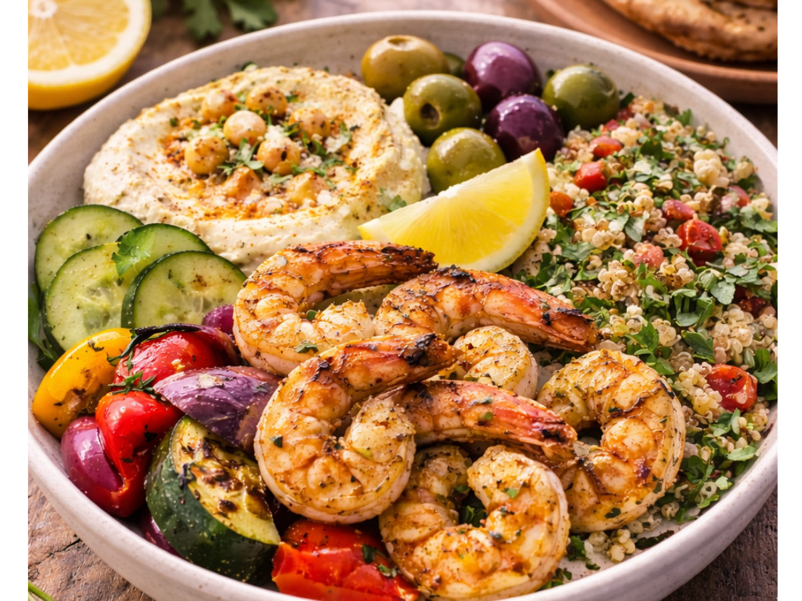
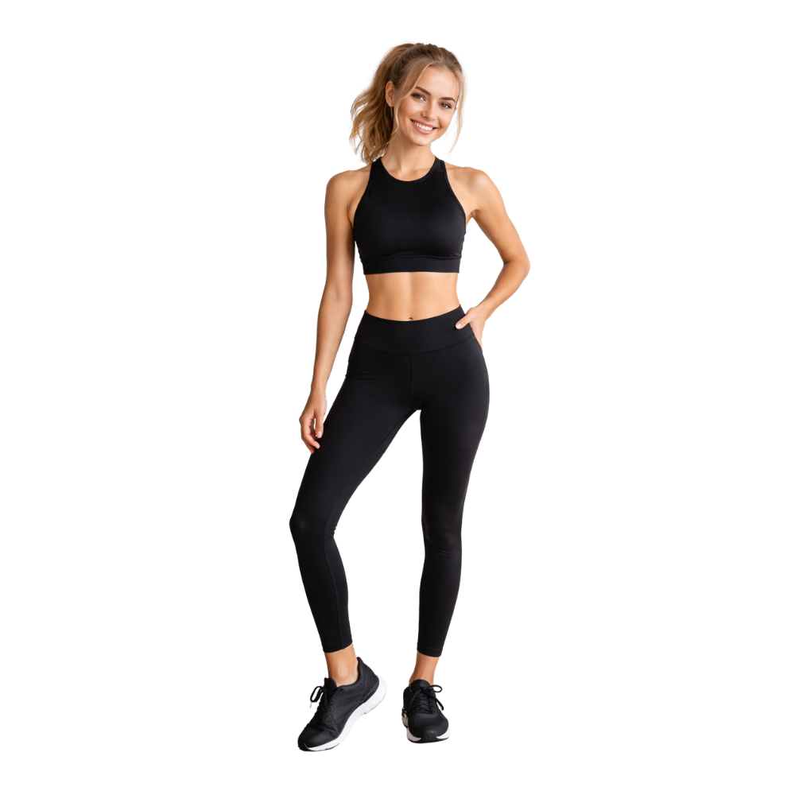
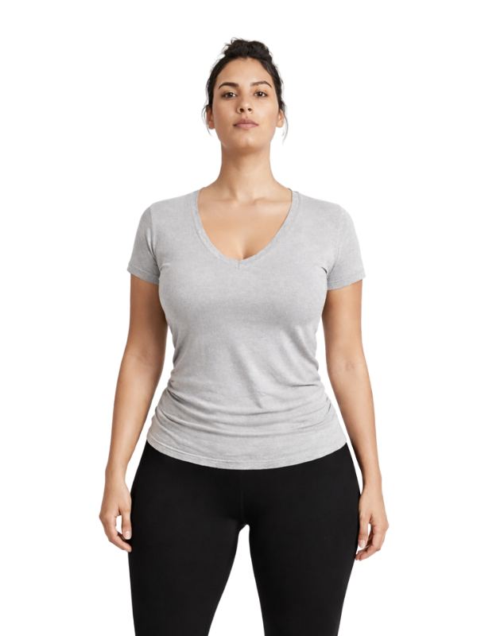
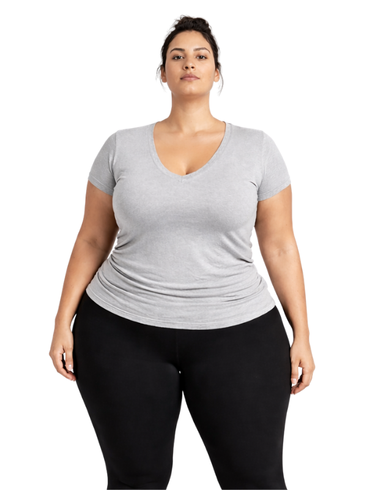
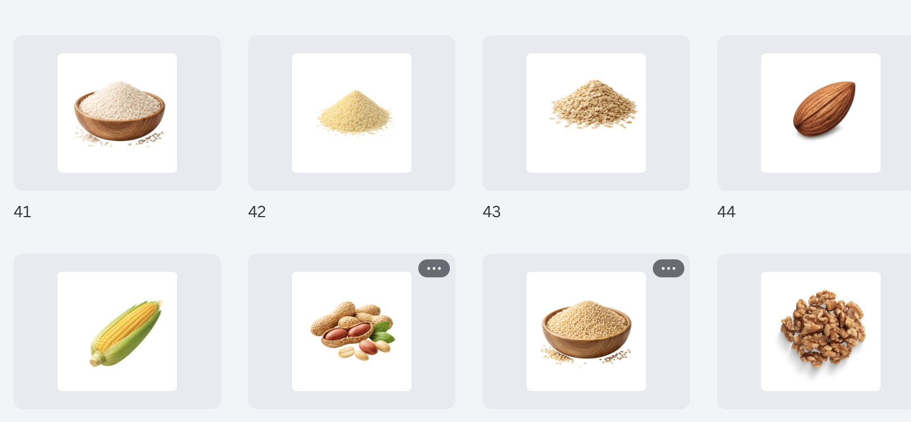

# 1.  QUIZ PAGES (coded step)

## **QUIZ**

### Let’s personalize your Mediterranean Coach and build your program for weight-loss and longevity nutrition

### Select your program :

- 👨  Program for Men
- 👩  Program for Women

<aside>
‼️

**Before we build your plan — read this.**

If you've tried keto, calorie counting, or intermittent fasting and felt like you failed.

You didn't fail. The plan failed you.

Those systems were built on old science. Fixed rules. Generic templates.

They were never designed for how a man’s body actually works.

That changes right now.

Answer honestly. We'll do the rest.

</aside>

1. **How familiar are you with Mediterranean diet & Blue Zones phenomena?**
- I’m new to it
- I know the basics
- I’ve tried it before

<aside>
‼️

**INFO BLOCK**

### Their Secret To A Lean Body And Long Life. Now Finally Yours.

People in the world's longest-living regions  called **Blue Zones** — outlive everyone else.

They're also in better shape. Leaner. More energetic. And by every measure, among the happiest people on earth.

They don't count calories. They don't cut carbs. They eat real food, healthy fats, good ingredients.

It works because it was always personal.

Until now, nobody could replicate that for you. Specialist teams couldn't. Generic plans couldn't.

Now, an AI trained on millions of cases can.

It reads decades of research. It builds around your exact profile, in minutes.

**For the first time, the world's most proven longevity diet is being built around you, not everyone.**

</aside>

**FOR MEN:**

1. **What do you want to achieve?**

Select all that apply:

- Lose body fat
- Get a lean body
- Build muscle
- Have more energy
- Improve my health
- Live longer

**FOR WOMEN:**

**What do you want to achieve?**

Select all that apply:

- Lose body fat
- Get a slimmer body
- Tone my body
- Have more energy
- Improve my health
- Live longer

1. **How would you describe your body now?**

- Slim
- Average
- Some belly fat
- Overweight

**FOR MEN:**

1. **What body do you want?**

Here, the user selects one answer, clicks on it, and moves to the next one

- A little slimmer
- Lean and fit
- Athletic
- Strong and defined

**FOR WOMEN:**

1. **What body do you want?**
    
    
    
- Feel like myself again
- Lose stubborn belly fat
- Feel lighter and more confident
- Look toned and youthful

1. **Which areas would you like to improve?**

(If you are happy with your body, press Continue)

- Arms
- Chest
- Back
- Stomach
- Legs
- Glutes

1. **What does your day usually look like?**

- I sit most of the day
- I move a lot
- I exercise often
- I stay at home

1. **How is your energy during the day?**

- Low most of the time
- I feel tired after lunch
- My energy goes up and down
- My energy is steady

1. **How often do you exercise?**
- Never
- A few times a month
- A few times a week
- Almost every day

1. **How does your weight usually change?**
- I gain weight fast and lose it slowly
- I lose weight but gain it back
- My weight stays the same
- I find it hard to build muscle

<aside>
‼️

### INFO BLOCK

☝️ **Your metabolism isn't broken. It's been given the wrong plan.**

Your body changes. Most plans don't.

A nutritionist sees you once a week. One hour. Limited data.

That's not personalization. That's guesswork on a schedule.

**Our AI-powered system runs 24/7.**

Trained on hundreds of years of research. Millions of real cases.

It adjusts when you adjust.

It never stops working on you.

</aside>

1. **When were you last at your best weight?**
- Less than 1 year ago
- 1–3 years ago
- More than 3 years ago
- I have never been at my best weight

1. **Have you tried any of these diets in the last 3 years?**

Select all that apply:

- Keto
- Intermittent fasting
- Low-carb
- Vegetarian
- Vegan
- Gluten free
- Other
- None of these

 

<aside>
‼️

**INFO BLOCK**

**Those diets weren't wrong because you did them wrong.**

They were wrong because they never changed.

Keto. Calorie counting. Low fat. High grain.

You followed the rules. Your body adapted. The plan didn't.

That's why it stopped working.

A diet that can't evolve with you isn't a diet. It's a timer.

**The science is clear now. Static plans fail. Always.**

Your body is not static. Your plan shouldn't be either.

</aside>

1. **What would getting in shape change most for you?**
- How I feel when I look in the mirror
- Feeling like myself again
- My energy with my kids / family
- My confidence around others
- How I feel for my partner
- My long term health
- How my clothes fit

1. **What is your height?**

(Height input)

<aside>
‼️

**INFO BLOCK #**

📌 We use your height and weight to calculate your Body Mass Index (BMI).

BMI helps us understand your current weight range.

</aside>

1. **What is your current weight?**

(Weight input)

<aside>
‼️

**INFO BLOCK**

✔️ Mediterranean eating can help support healthy weight, strong muscles, and steady energy.

**If BMI is in the normal range**

**Your BMI is XX, which is in the healthy range.**

That’s a great starting point.

Now the goal is to maintain your weight, improve body shape, and support your metabolism.

We will use your BMI to create yourPersonalized Mediterranean Coaching System and help you stay fit and strong.

---

**If BMI is overweight**

**Your BMI is XX, which is in the overweight range.**

This means your body may be storing extra fat.

With the right nutrition plan, you can move toward a healthier weight.

We will use your BMI to build your Personalized Mediterranean Coaching System.

---

**If BMI is obese**

**Your BMI is XX, which is in the obese range.**

This means your body is carrying more weight than recommended.

Losing even a small amount of weight can improve your health and energy.

We will use your BMI to create a Personalized Mediterranean Coaching System that helps you lose weight in a healthy and steady way.

</aside>

<aside>
‼️

### INFO BLOCK:

☝️ **That advice you were given? It was wrong.**

For years they said eat less fat. Count every calorie. Follow the pyramid.

Millions followed it perfectly. Millions still struggled.

The foundation was backwards. Not you.

The science has caught up. Your plan reflects that.

</aside>

1. **What is your target weight?**

(Weight input)

<aside>
‼️

**☝️ HEALTH BENEFITS: Lose XX% of your weight**

Studies show that losing even 10% of your body weight can improve your health.

It may help lower the risk of heart disease, high blood sugar, and inflammation in the body.

Small changes can make a big difference.

---

**☝️ BIGGER GOAL: Lose XX% of your weight**

Research shows that people who lose more than 20% of their body weight often improve their metabolic health more than those who lose only 5–10%.

Losing more weight can lead to better energy, better blood sugar control, and better overall health.

</aside>

1. **What is your age?**

<aside>

### INFO BLOCK:

☝️ **Age changes your metabolism, but it doesn’t stop results.**

As we get older, the body responds differently to food.

That’s why one-size-fits-all diets often fail after 30 or 40.

Your plan must adjust to your stage of life.

</aside>

<aside>
‼️

## Here’s What We Found

**Your Body Mass Index (BMI)**

You: XX.X

Underweight | Healthy | Overweight | Obese

✔️ A balanced Mediterranean Coaching System can help you manage weight and support your metabolism.

**If BMI is in the normal range**

**Your BMI is XX, which is in the healthy range.**

That’s a great starting point.

Now the goal is to maintain your weight, improve body shape, and support your metabolism.

We will use your BMI to create your Personalized Mediterranean Coaching System and help you stay fit and strong.

---

**If BMI is overweight**

**Your BMI is XX, which is in the overweight range.**

This means your body may be storing extra fat.

With the right nutrition plan, you can move toward a healthier weight.

We will use your BMI to build your Personalized Mediterranean Coaching System

---

**If BMI is obese**

**Your BMI is XX, which is in the obese range.**

This means your body is carrying more weight than recommended.

Losing even a small amount of weight can improve your health and energy.

We will use your BMI to create a personalized plan that helps you lose weight in a healthy and steady way.

📊 BMI: XX
⚡ Energy: [customer answer]
🔥 Metabolism: Adaptable — not broken
🎯 Goals: [customer selected goal]

Continue →

</aside>

1. **How many meals would you like to eat each day?**

You can change this later in your settings.

- Two (Breakfast and dinner, with optional snacks)
- Three (Breakfast, lunch, and dinner)
- Four (Breakfast, snack, lunch, and dinner)
- Five (Breakfast, lunch, dinner, and two snacks)

1. **Would you like to exclude any of these foods?**

---

**Proteins & dairy:**

- I eat everything
- Chicken
- Red meat
- Cheese
- Tuna
- Greek yogurt
- Salmon
- Shrimp
- Eggs
- Chickpeas
- Lentils
- Tofu

1. **Would you like to exclude any of these foods?**

---

**Fruits & vegetables:**

- I eat everything
- Tomatoes
- Cucumber
- Broccoli
- Spinach
- Zucchini
- Bell pepper
- Avocado
- Olives
- Onions

 

1. **Would you like to exclude any of these foods?**

---

**Grains & nuts:**

- I eat everything
- Rice
- Couscous
- Quinoa
- Oats
- Almonds
- Walnuts
- Peanuts
- Corn

<aside>

### GENERATING SCREEN TEXT:

Analyzing your metabolic profile…

Reviewing food preferences…

Comparing with Blue Zone longevity data…

Processing latest nutrition research…

Adjusting macro proportions…

Building your adaptive Mediterranean Coaching system…

☝️ **For the first time in history, this level of personalization is possible.**

Your Personalized Mediterranean Diet is powered by AI that can process more data than any human nutritionist ever could.

It doesn’t follow fixed rules.

It evolves with you.

Until it works FOR YOU.

</aside>

<aside>

BEFORE EMAIL COLLECTION

### INFO BLOCK:

☝️ **This is not another fixed meal plan.**

Your Mediterranean Program is powered by AI coaching.

It adapts based on your progress, energy levels, and feedback.

You don’t need to guess.

The system evolves with you.

</aside>