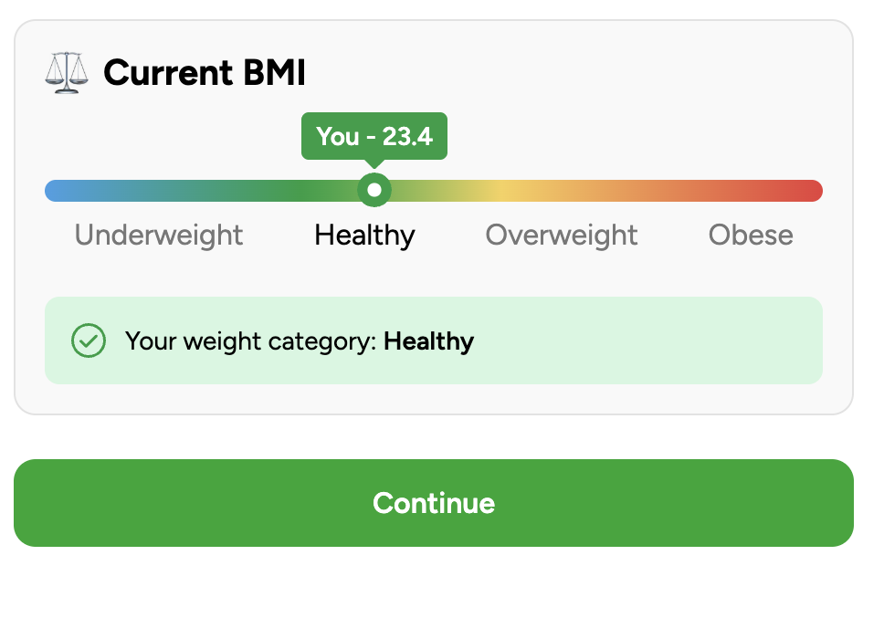

# 3. RESULTS PAGE (coded step)

**Your Personalized Mediterranean Coach Is Ready**

## 1 SECTION

### Your Personal Metabolic Snapshot

Based on your answers, your metabolism may be slightly out of balance.

This can make fat loss harder, increase belly storage, and raise inflammation.

Over time, metabolic imbalance is linked to lower energy and higher risk of chronic disease.

**This isn’t a discipline issue.**

It’s a mismatch between outdated diet rules and your current metabolic stage.

The good news? It’s reversible.

Blue Zone research shows that when you eat in alignment with your body, metabolism stabilizes and inflammation drops.

**Your plan is built on that science.**

---

## 2 SECTION

### **Current BMI**

You – **XX**

Underweight

Healthy

Overweight

Obese

**Your Weight Category: xx**

But BMI alone doesn’t tell the full story.

Two people can have the same BMI and completely different metabolic responses.

That’s why your plan is not based on generic calorie formulas.

It’s based on adaptive metabolic alignment.

---

### 3 SECTION

---

<aside>

## Meet Your Bio-Adaptive Weight Coaching System

Built on AI and 70 years of Blue Zone longevity & weight-loss science.

---

**1️⃣ AI Metabolic Intake Engine**

Your inputs (body type, activity level, energy patterns, food preferences) are analyzed to determine optimal food proportions for your metabolic stage.

Not yesterday’s nutrition model.

Today’s.

---

**2️⃣ Adaptive Mediterranean Blueprint**

Built on eating patterns observed in the world’s longest-living Mediterranean regions:

- Emphasis on whole foods
- Strategic healthy fats
- Balanced protein
- Controlled refined carbs
- Anti-inflammatory focus

But personalized.

Your plan adjusts as your body adapts, helping reduce plateaus and metabolic slowdown.

---

**3️⃣ Your Live AI Coach**

Most programs give you a plan and leave you to figure it out.

This one listens.

Don't like a meal? Tell your coach — it finds something you'll actually enjoy.
Skipping workouts? It adjusts the intensity until it fits your life.
Hit a plateau? It recalibrates before frustration sets in.

As your weight, energy and consistency change:

- Meals shift to what works for you
- Workouts adapt to what you'll actually do
- Balance recalibrates to where your body is now

No guessing. No white-knuckling through food you hate.

**You don't restart. You refine.**

The longer you use it — the better it knows you.
The better it knows you — the better it works.

---

## 4 SECTION

### What’s Included Inside Your System

**✔ Unlimited Adaptive Mediterranean Meals**

Matched to your preferences.

Enjoyable. Structured. Sustainable.

---

**✔ Personalised Metabolic Movement**

Strength, mobility, recovery.

Fat-loss support without burnout.

---

**✔ Habit & Consistency Challenges**

Small strategic actions.

Rhythm beats motivation.

---

**✔ Longevity & Metabolism Guides**

Learn why inflammation, processed foods, and modern diet rules disrupt fat loss.

Clarity removes confusion.

---

**✔ Adaptive Progress Tracking**

Track weight, body changes, energy, and habits.

Your plan adjusts as you progress.

</aside>